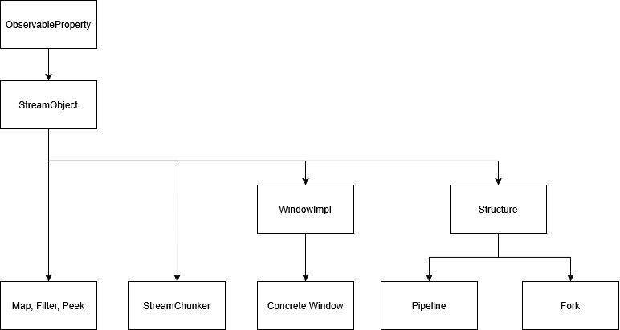

# Event Library

since DRAGONS' communication is based primarily on events
we think it is useful to have an overview on every event DRAGON provides and how to use and access these events.

All events work with the same principle and are accessible viá its respective event name.

Your functions can subscribe to an event using the

```
object.add_listener("event_name", your_listener)
```

Since the stream is a central and unique component you can address its event directly by subscribing to the stream
using:

```
stream.add_listener(your_listener)
```

This automatically calls the function listening to this event once the event is raised.

In this table we provide an overlook of all currently available events in DRAGON.

| Class                   | Event Name            | Listener type | 
|:------------------------|:----------------------|---------------|
| __Stream__              | new_data_point        | StreamObject  | 
| __Stream__              | stream_finished       | StreamObject  | 
| __StreamObject__        | out_flow              | function      | 
| __StreamObject__        | state_changed         | function      | 
| __ObservableProperty__  | property_changed      | function      |
| __Structure__           | structure_changed     | function      |
| __DriftDetector__       | drift_detected        | function      |
| __ChangePointDetector__ | changepoint_localized | function      |

---

If an Event has _no direct access_ for any reason, you can write your own listening method using the event system:

```
object.event_handler.add_listener("event_name", your_listener)
```

Note that this can may unwanted effects and is not recommended.

---

If you are not sure which of your objects has which event available, this diagram may help:



This diagram shows (parts of) the hierarchy for StreamObjects.

For example if an object is StreamObject it automatically has the ObservableProperty events, too!

---